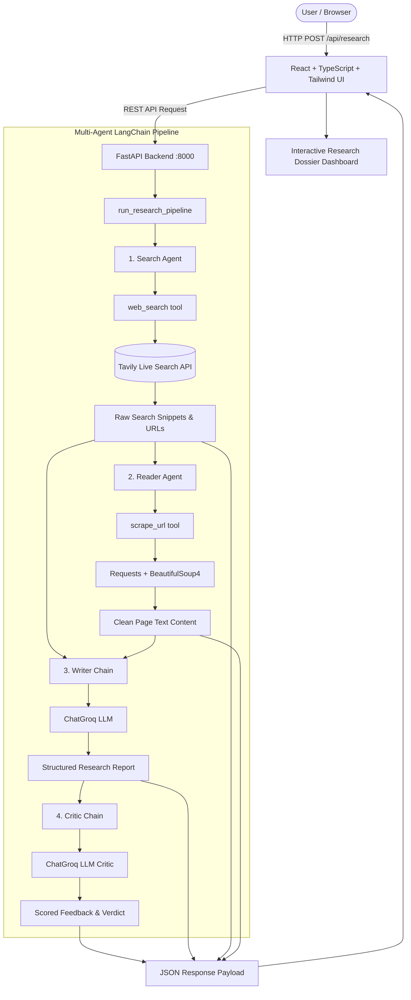

# ResearchOS — Multi-Agent Research Assistant

[](https://python.langchain.com/)
[](https://fastapi.tiangolo.com/)
[](https://react.dev/)
[](https://tailwindcss.com/)

**ResearchOS** is an autonomous multi-agent research assistant that combines live web search, deep web scraping, LLM synthesis, and strict analytical critique into a polished full-stack application.

---

## 🌟 Architecture Overview



---

## 🛠 Tech Stack

### Backend
- **Python 3.13**
- **LangChain & LangChain Community**: Agent runtime and orchestration
- **LangChain Groq (`ChatGroq`)**: Ultra-fast LLM inference
- **Tavily Search API**: Live web search engine for AI agents
- **BeautifulSoup4 & Requests**: Text scraping and DOM cleanup
- **FastAPI**: Modern, high-performance async web framework
- **Uvicorn**: ASGI web server
- **Pydantic v2**: Request/response schema validation

### Frontend
- **React 18 & TypeScript**
- **Vite**: Ultra-fast build tool and dev server
- **Tailwind CSS**: Modern utility-first styling with custom dark theme
- **Lucide React**: Clean, modern iconography
- **React Markdown & Remark GFM**: Markdown parsing with GitHub-flavored markdown support

---

## 🚀 Quick Start Guide

### Prerequisites
- Python 3.10+
- Node.js 18+ and npm
- Groq API Key ([Groq Console](https://console.groq.com/))
- Tavily API Key ([Tavily AI](https://tavily.com/))

---

### 1. Backend Setup

1. **Activate Virtual Environment:**
   ```bash
   source .venv/bin/activate
   ```
   *(Or create a new one: `python3 -m venv .venv && source .venv/bin/activate`)*

2. **Install Python Dependencies:**
   ```bash
   pip install -r requirement.txt
   ```

3. **Configure Environment Variables:**
   Copy `.env.example` to `.env` and fill in your API keys:
   ```bash
   cp .env.example .env
   ```
   Edit `.env`:
   ```env
   GROQ_API_KEY=gsk_...
   TAVILY_API_KEY=tvly-...
   ```

4. **Start the FastAPI Server:**
   ```bash
   uvicorn api:app --reload --port 8000
   ```
   The backend API will run at `http://localhost:8000` (API Docs available at `http://localhost:8000/docs`).

---

### 2. Frontend Setup

1. **Navigate to the frontend directory:**
   ```bash
   cd frontend
   ```

2. **Install Node Dependencies:**
   ```bash
   npm install
   ```

3. **Configure Frontend Environment:**
   ```bash
   cp .env.example .env
   ```
   Ensure `.env` contains:
   ```env
   VITE_API_URL=http://localhost:8000
   ```

4. **Start the Vite Dev Server:**
   ```bash
   npm run dev
   ```
   Open `http://localhost:5173` in your browser.

---

## 📡 API Endpoints

### `GET /api/health`
Health check endpoint to verify backend service readiness.

**Response:**
```json
{
  "status": "ok"
}
```

---

### `POST /api/research`
Executes the multi-agent research pipeline for a given topic.

**Request Body:**
```json
{
  "topic": "latest AI agent frameworks"
}
```

**Response Body:**
```json
{
  "topic": "latest AI agent frameworks",
  "search_results": "Title=... URL:... Snippets:...",
  "scraped_content": "Clean text extracted from primary source...",
  "report": "# Research Report\n\n## Introduction\n...",
  "feedback": "Score: 8.5/10\n\nStrengths:\n- ...\n\nAreas to Improve:\n- ...\n\nOne line verdict:\n..."
}
```

---

## 🖼 UI Features & Screenshots

- **Sleek Dark Theme**: Designed with deep zinc backgrounds, glassmorphism cards, and emerald/cyan accent highlights.
- **Dynamic Pipeline Stepper**: Visual real-time indicator tracking Search Agent, Reader Agent, Writer Chain, and Critic Chain stages.
- **Tabbed Dossier Dashboard**:
  - 📝 **Report**: Polished Markdown viewer with word count, reading time estimate, and one-click markdown export.
  - ⚖️ **Critic Review**: Quality score out of 10, strengths audit, improvement areas, and overall verdict.
  - 🌐 **Sources & Search**: Formatted domain cards with external links and expandable snippets.
  - 📑 **Source Notes**: Collapsible scraped raw buffer viewer with copy-to-clipboard.

---

## 🗺 Future Roadmap

- [ ] **LangGraph StateGraph Migration**: Upgrade orchestration to cyclical LangGraph state machine with branching and human-in-the-loop validation.
- [ ] **Real-time SSE / Streaming Updates**: Stream agent step events via Server-Sent Events (SSE) or WebSockets directly to the frontend.
- [ ] **Multi-source deep scraping**: Parallel scraping of top-3 highest ranked search results.
- [ ] **Export to PDF**: Generate client-ready PDF reports with styling and cited source bibliographies.
